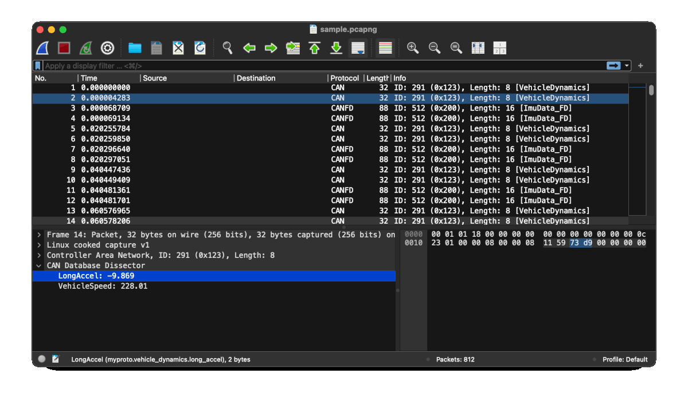

# dbc2shark

`dbc2shark` is a small CLI tool that converts a CAN DBC file (Vector DBC format) into a Wireshark Lua dissector. The generated Lua script registers fields for each DBC signal and decodes CAN frames based on `can.id`, making it easier to inspect signal values directly inside Wireshark.

## Installation

### From crates.io

```bash
cargo install dbc2shark
````

### From source

```bash
git clone https://github.com/haradama/dbc2shark.git
cd dbc2shark
cargo install --path .
```

## Usage

Generate a Lua dissector from a DBC file and write it to a file:

```bash
dbc2shark -i path/to/file.dbc > dbc_dissector.lua
```

### Options

* `-i, --input <FILE>`: Path to the input DBC file (required)
* `-p, --proto-name <NAME>`: Base name for the generated Wireshark `Proto` (default: `myproto`)

Example:

```bash
dbc2shark -i vehicle.dbc -p vehicle > vehicle.lua
```

## Using the Lua dissector in Wireshark

Generate the Lua script.

 ```bash
 dbc2shark -i your.dbc -p yourproto > yourproto.lua
 ```

Copy the script to Wireshark's Lua plugin folder. The exact location depends on your OS and Wireshark installation.

Restart Wireshark

Open a capture that contains CAN frames

As long as Wireshark can decode the capture into CAN packets with a valid `can.id` field, the generated dissector will decode and show DBC signals for matching CAN IDs.



## License

MIT License. See `LICENSE` for details.

## Credits

* DBC parsing: [`can-dbc`](https://crates.io/crates/can-dbc)
* CLI: [`clap`](https://crates.io/crates/clap)
* Error handling: [`anyhow`](https://crates.io/crates/anyhow)
* Name casing: [`heck`](https://crates.io/crates/heck)
